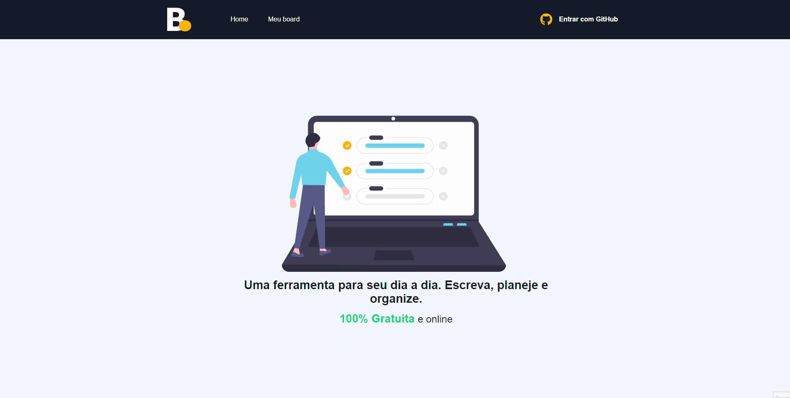

# Board App

### Acessar: [Board](https://board-tasks-app.herokuapp.com/)

## Sumário
- **[Sobre](#sobre)**
- **[Pré-requisitos](#pré-requisitos)**
- **[Instalação](#instalação)**
- **[Tecnologias](#tecnologias)**

## GIF do Board

## Sobre

Feito com NextJS. Um projeto de gestão de tarefas, onde foi utilizado a lib NextAuth e o GitHub para autenticação de usuários. O serviço back-end utilizado foi o banco de dados Firestore. Por padrão, todos os usuários autenticados possuem as funcionalidades de adicionar e excluir tarefas. Fiz a integração com a API do PayPal para pagamentos, e assim, usuários que fizerem uma doação independente do valor terão acesso à funcionalidades exclusivas (visualizar e editar tarefas) além da foto de perfil do GitHub ficar visível na tela inicial.

## Pré-requisitos
Antes de começar, você precisa ter instalado em sua máquina as seguintes ferramentas: [Git](https://git-scm.com). Além disso, é interessante que tenha instalado um editor de código como o [VSCode](https://code.visualstudio.com/).

## Instalação

### Clone este repositório
`$ git clone https://github.com/guigovaski/next-board.git`

### Instala as dependências
`$ npm install`

### Execute o servidor
`$ npm run start`

## Tecnologias
As seguintes tecnologias foram utilizadas para desenvolver este projeto:
- [Next](https://nextjs.org/)
    - [Next-auth](https://next-auth.js.org/)
- [React](https://pt-br.reactjs.org/)
- [Firebase](https://firebase.google.com/)
- [Sass](https://sass-lang.com/)
- [Typescript](https://www.typescriptlang.org/)
